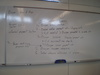
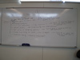
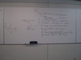
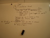
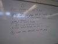
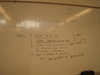
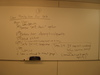
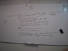

This page contains examples of design artifacts, including the results of in-class activities.

# Use cases

Results of in-class use cases exercise on Jan 29th.  Click on a thumbnail for the full size image.

> Section | Results
> ------- | -------
> Section 102 |    
> Section 103 |    
